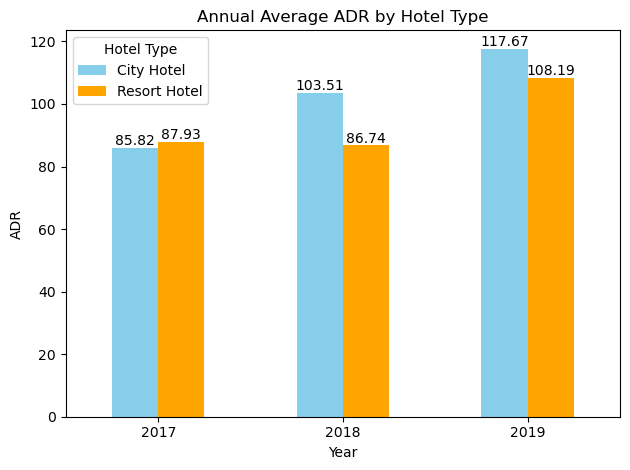

# Investigate-Hotel-Business

## Business Understanding

Sangat penting bagi suatu perusahaan untuk selalu menganalisa performa bisnisnya. Pada kesempatan kali ini, kita akan lebih mendalami bisnis dalam bidang perhotelan. Fokus yang kita tuju adalah untuk mengetahui bagaimana perilaku pelanggan kita dalam melakukan pemesanan hotel, dan hubungannya terhadap tingkat pembatalan pemesanan hotel. Hasil dari insight yang kita temukan akan kita sajikan dalam bentuk data visualisasi agar lebih mudah dipahami dan bersifat lebih persuasif

## Data Preprocessing

| Data Assesment               | Finding                                                 | Handling        |
| ---------------------------- | ------------------------------------------------------- | --------------- |
| Missing values               | company, agent, city, children                          | ffill dan mean |
| Duplicates rows              | >20%                                                    | keep data       |
| Outliers                     | adr (nilai negatif)                                     | replace 0 (nol) |
| Data anomaly                 | terdapat bookings tanpa tamu (adults = 0, children = 0) | hapus data      |
| Date out of range            | 31 september (365 data), 29 februari (990 data)         | hapus data      |
| Incorrect/Improper tipe data | children (float)                                        | convert ke int  |

Aggregasi average pada feature numerik, perbandingan antara City Hotel dan Resort Hotel

| Feature                        | City Hotel | Resort Hotel | Percentage Diff |
| ------------------------------ | ---------- | ------------ | --------------- |
| is_canceled                    | 0.417986   | 0.278062     | 33.48           |
| lead_time                      | 109.830384 | 92.618174    | 15.67           |
| arrival_date_day_of_month      | 15.643924  | 15.612375    | 0.2             |
| stays_in_weekend_nights        | 0.793916   | 1.196611     | -50.72          |
| stays_in_weekdays_nights       | 2.174223   | 3.132915     | -44.09          |
| adults                         | 1.853479   | 1.866604     | -0.71           |
| children                       | 0.091041   | 0.128052     | -40.65          |
| babies                         | 0.004861   | 0.013778     | -183.41         |
| is_repeated_guest              | 0.025099   | 0.044296     | -76.49          |
| previous_cancellations         | 0.080081   | 0.103054     | -28.69          |
| previous_bookings_not_canceled | 0.132689   | 0.147553     | -11.2           |
| booking_changes                | 0.183703   | 0.287256     | -56.37          |
| agent                          | 34.168157  | 191.02225    | -459.07         |
| company                        | 6.765258   | 18.686633    | -176.21         |
| days_in_waiting_list           | 3.177055   | 0.361184     | 88.63           |
| adr                            | 105.435565 | 94.104191    | 10.75           |
| required_car_parking_spaces    | 0.024231   | 0.138107     | -469.96         |
| total_of_special_requests      | 0.546222   | 0.618377     | -13.21          |

**Insight:**

1. Rata-rata jumlah cancel City Hotel 33% lebih besar dari Resort Hotel
2. Resort Hotel 15% lebih cepat dalam menangani Bookings dibandingkan City Hotel
3. Baik City Hotel dan Resort Hotel, banyak dipesan pada tanggal 15 atau minggu kedua setiap bulannya.
4. Baik weekday atau weekend, jumlah malam yang dipesan pada Resort Hotel lebih tinggi dari City Hotel.
5. Rata-rata jumlah tamu dewasa yang menginap di City Hotel dan Resort Hotel adalah 1, sedangkan yang membawa anak atau bayi resort hotel sedikit lebih banyak namun rata-ratanya tidak semua membawa anak.
6. Mayoritas pemesan Resort Hotel dan City Hotel bukanlah Tamu yang pernah menginap sebelumnya. (2/100 City Hotel, 4/100 Resort Hotel).
7. Mayoritas pemesan City Hotel dan Resort Hotel tidak pernah melakukan pembatalan pemesanan. (<1)
8. Mayoritas pemesan City Hotel dan Resort Hotel tidak melakukan pembatalan pada pemesanan terakhir (<1)
9. Mayoritas pemesan City Hotel dan Resort Hotel tidak pernah melakukan perubahan pemesanan. (<1)
10. Rata-rata fee agent untuk City Hotel sebesar 34, sedangkan Resort Hotel 191 atau 6x lebih besar dari City Hotel.
11. Rata-rata waiting list pada pemesanan City Hotel adalah 3 hari, sedangkan Resort Hotel adalah 0 hari.
12. ADR (Average Daily Rate), City Hotel lebih besar dari Resort Hotel.
13. Mayoritas pemesan City Hotel dan Resort Hotel tidak membutuhkan ruang parkir (<1).
14. 50-60% dari pemesan City Hotel dan Resort Hotel melakukan permintaan khusus.

## Annual Total Bookings and Average ADR

 

**Insight:**

Jumlah pemesanan pada City Hotel selalu lebih tinggi dari Resort Hotel dari tahun ke tahun. Baik City Hotel dan Resort Hotel mengalami peningkatan jumlah bookings pada tahun 2018 namun mengalami penurunan di tahun berikutnya (2019). Untuk mengetahui penyebab atau faktor apa saja yang menyebabkan hal tersebut, akan dilakukan analisa lebih lanjut pada tingkat perbulan (Monthly).

ADR digunakan untuk menghitung pendapatan sewa rata-rata per kamar yang ditempati pada waktu tertentu. ADR didapatkan dari total pendapatan (revenue) dibagi dengan jumlah kamar yang terjual. Annual ADR pada City Hotel selalu mengalami kenaikan di setiap tahunnya, sedangkan Resort Hotel terjadi sedikit penurunan di tahun 2018 dan kembali peningkatan di tahun berikutnya (2019). Untuk melihat lebih jelas faktor apa yang menjadi kenaikan/penurunan ini, akan dilakukan analisa pada tingkat perbulan (monthly).

## Annual Cancel Rate and Total Cancel by Hotel Type

**Insight:**

Jumlah tamu yang melakukan pembatalan mengalami kenaikan lebih dari 100% dari tahun 2017 ke 2018. Hal ini menunjukkan adanya peningkatan signifikan dalam jumlah pembatalan.
Meskipun demikian, tingkat pembatalan (cancel rate) justru menurun. Ini mungkin disebabkan oleh peningkatan jumlah total pemesanan yang lebih besar dari peningkatan jumlah pembatalan. Dengan kata lain, peningkatan jumlah tamu yang memesan kamar mungkin lebih signifikan daripada peningkatan jumlah pembatalan, sehingga cancel rate secara relatif menurun.

Jumlah pembatalan menurun dari tahun 2017 ke 2018. Hal ini menunjukkan bahwa hotel berhasil mengurangi jumlah pembatalan dari tahun ke tahun.
Meskipun jumlah pembatalan menurun, tingkat pembatalan (cancel rate) meningkat. Hal ini bisa terjadi jika penurunan jumlah pembatalan tidak sebanding dengan peningkatan jumlah total pemesanan. Dengan kata lain, peningkatan jumlah tamu yang memesan kamar mungkin tidak cukup besar untuk mengimbangi penurunan jumlah pembatalan, sehingga cancel rate meningkat secara relatif.

Kesimpulannya, meskipun jumlah pembatalan dapat meningkat atau menurun dari tahun ke tahun, cancel rate (persentase pembatalan dari total pemesanan) akan dipengaruhi oleh perubahan dalam jumlah total pemesanan. Hal ini menunjukkan pentingnya melihat secara holistik tidak hanya jumlah pembatalan tetapi juga total pemesanan untuk mendapatkan pemahaman yang lebih lengkap tentang tingkat pembatalan sebenarnya.

## Monthly Hotel Booking Analysis Based on Hotel Type

**Insight:**

Dari periode Januari 2017 hingga Oktober 2019 (33 bulan), terdapat 8 bulan yang tercatat 0 yaitu maret-agustus 2017 dan februari-maret 2019.

Rata-rata pemesanan di City Hotel jauh lebih tinggi daripada di Resort Hotel, bahkan hingga dua kali lipat. Baik City Hotel maupun Resort Hotel mengalami peningkatan pemesanan selama April-Agustus dan Oktober-Desember. Peningkatan ini sebagian besar disebabkan oleh musim liburan sekolah pada April-Agustus. Orang-orang cenderung berlibur ke berbagai destinasi wisata, baik di kota (City Hotel) maupun di alam (Resort Hotel), karena cuaca yang cerah memungkinkan aktivitas wisata yang lebih banyak.

Sementara itu, pada periode Oktober-Desember, banyak orang merayakan liburan akhir tahun dengan melakukan perjalanan baik ke kota (City Hotel) maupun ke alam (Resort Hotel). Kedua periode liburan ini memicu peningkatan pemesanan hotel secara signifikan.

**Insight:**

Resort Hotel memiliki rata-rata jumlah malam yang lebih tinggi setiap bulannya dibandingkan dengan City Hotel, mungkin karena Resort Hotel menawarkan pengalaman liburan yang lebih panjang dan santai, serta biasanya terletak di destinasi liburan alam yang menarik.

Di Resort Hotel, terjadi tren kenaikan pada bulan Agustus, yang mungkin disebabkan oleh liburan musim panas dan tingginya permintaan akan akomodasi di destinasi wisata alam. Namun, tren penurunan dimulai pada bulan Oktober, yang bisa disebabkan oleh berakhirnya musim liburan musim panas dan beralihnya wisatawan ke destinasi lain atau kembali ke rutinitas mereka. Sementara itu, kestabilan rata-rata jumlah malam setiap bulannya di City Hotel, yang berkisar antara 2-3 malam dari Januari 2017 hingga Oktober 2019, mungkin disebabkan oleh sifat perjalanan yang lebih singkat atau tujuan kunjungan yang lebih bisnis daripada liburan yang berlama-lamaan.

**Insight:**

City Hotel memiliki rata-rata harga kamar (ADR) yang lebih tinggi setiap bulannya dibandingkan dengan Resort Hotel. Pada Resort Hotel, terjadi tren kenaikan secara bertahap dari bulan Maret hingga Oktober, dengan ADR naik dari 46.93 hingga 190.96 pada tahun 2018, dan dari 51.17 hingga 207.35 pada tahun 2019. Hal ini mungkin disebabkan oleh meningkatnya permintaan akomodasi selama musim liburan atau peningkatan popularitas resort sebagai destinasi liburan. Sementara itu, pada City Hotel, juga terjadi tren kenaikan dari bulan Maret hingga Oktober, dengan ADR meningkat dari 76.33 hingga 118.15 pada tahun 2018, dan dari 86.25 hingga 139.42 pada tahun 2019. Peningkatan ini mungkin mencerminkan peningkatan permintaan akomodasi di kota selama musim liburan atau karena faktor-faktor lain seperti acara khusus atau konferensi yang menarik banyak tamu.

## Impact Analysis of Stay Duration on Hotel Bookings Cancellation Rates

 

**Insight:**

Perbandingan distribusi total nights atau durasi menginap berdasarkan type hotel dan cancelation. Secara rata-rata dan standar deviasi, City Hotel memiliki nilai yang lebih rendah dibandingkan Resort Hotel.
Rata-rata pembatalan pemesanan City Hotel adalah yang berdurasi 3 malam, sedangkan Resort Hotel adalah yang berdurasi 4 malam.

Pada City Hotel, terdapat kecenderungan bahwa cancelation rate meningkat seiring dengan peningkatan durasi menginap. Di sisi lain, pada Resort Hotel, cancelation rate meningkat hingga durasi menginap mencapai 4 minggu. Namun, setelah melewati durasi tersebut, terjadi penurunan dalam cancelation rate, mencapai 28% saat durasi menginap lebih dari 4 minggu. Hal ini menunjukkan pola yang berbeda dari City Hotel, di mana kenaikan cancelation rate tidak berlanjut setelah durasi menginap tertentu.

Untuk meningkatkan retensi tamu, City Hotel dapat mempertimbangkan untuk menawarkan lebih banyak paket atau promosi yang berfokus pada pengalaman menginap yang lebih lama, seperti diskon untuk menginap lebih dari dua minggu atau paket all-inclusive untuk menginap bulanan. Untuk mengurangi tingkat cancelation di Resort Hotel, manajemen dapat meninjau kebijakan pembatalan dan menawarkan insentif khusus bagi tamu yang memesan menginap untuk periode yang lebih lama. Selain itu, memperluas jangka waktu pembatalan yang lebih panjang untuk tamu yang memesan jauh-jauh hari juga dapat membantu mengurangi cancelation rate.

## Impact Analysis of Stay Duration on Hotel Bookings Cancellation Rates

 

**Insight:**

Perbandingan distribusi lead time berdasarkan type hotel dan cancelation. Secara rata-rata dan standar deviasi, City Hotel memiliki nilai yang lebih tinggi dibandingkan Resort Hotel.
Rata-rata pembatalan pemesanan City Hotel adalah yang melakukan pemesanan di 150 hari sebelumnya, sedangkan Resort Hotel adalah yang melakukan pemesanan di 128 hari sebelumnya.

Pada City Hotel dan Resort Hotel, terdapat tren kenaikan tingkat pembatalan seiring dengan peningkatan lead time. Resort Hotel memiliki tingkat pembatalan yang lebih rendah dibandingkan dengan City Hotel pada lead time yang sama. Perbedaan antara keduanya sekitar 5-10% pada lead time maksimal di 180 hari (6 bulan), sedangkan perbedaan meningkat menjadi lebih dari 20% saat lead time melebihi 365 hari atau 1 tahun.

Fenomena ini mungkin mencerminkan pola perilaku reservasi yang berbeda antara kedua jenis hotel. Meskipun keduanya mengalami peningkatan pembatalan seiring dengan meningkatnya lead time, kecenderungan untuk membatalkan reservasi tampaknya lebih tinggi di City Hotel daripada di Resort Hotel. Hal ini bisa dipengaruhi oleh kebijakan pembatalan yang berbeda, jenis perjalanan yang lebih fleksibel di City Hotel, atau preferensi tamu yang berbeda terkait dengan perencanaan jauh-jauh hari.

## Reports in Tableau

*-- on progress --*
